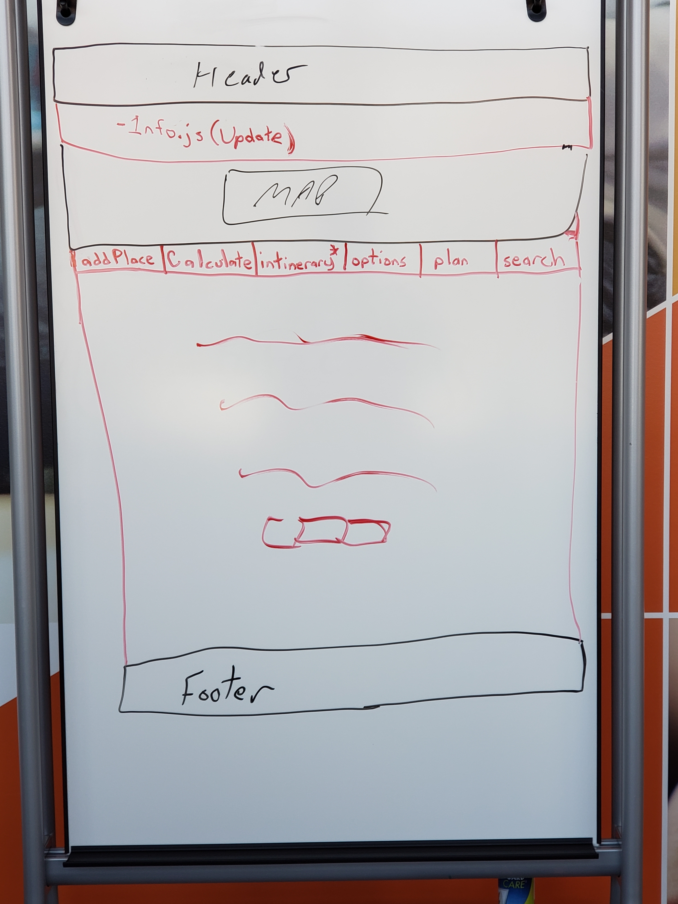

# Sprint 5 - t07 - double07

## Goal

### Wrap It Up!
### Sprint Leader: Dmitry Melnikov

## Definition of Done

* Sprint Review and Retrospectives completed (sprint5.md).
* Version in pom.xml should be `<version>5.0.0</version>`.
* Increment deployed for demo and testing as server-5.0.jar on the production server.
* Increment release `v5.0` created on GitHub with appropriate version number and name.
* Epics and Tasks updated in Zenhub.

## Policies

#### Test Driven Development
* Write method headers, javadoc, unit tests, and code in that order for all methods/functions.
* Unit tests are fully automated.
* Code coverage is at least 50%, 70% preferred.
#### Clean Code
* Code Climate maintainability of A or B.
* Code adheres to Google style guides for Java and JavaScript.
#### Configuration Management
* Always check for new changes in master to resolve merge conflicts locally before committing them.
* All changes are built and tested before they are committed.
* All commits with more than 1 line of change include a task/issue number.
* All pull requests include tests for the added or modified code.
* All tests pass.
* Master is never broken.  If broken, it is fixed immediately.
#### Continuous Integration / Delivery
* Travis successfully builds and tests on all pull requests for master branch.
* All Java dependencies in pom.xml.  Do not load external libraries in your repo. 
* All pull requests are deployed on the development server.
* The development server is never broken.  If broken, it is fixed immediately.

## Plan

We are planning to finish the pending tasks from Sprint 4, and to fix issues that our team noticed during our review of Sprint 4. Additionally we plan to add about section to introduce our team members to the web app. The main focus after that will be to improve user experience of our web app.

Above is a diagram of the client component hierarchy. In Sprint 5 we will be adding Filter and map options to state of our app, no additional components will be created and the hierarchy will be similar to Sprint 4.

Above is a picture of our component diagram in the client view. In Sprint 5 we will be upgrading user experience to utilize tabs instead of having all of the functionality visible on the page at once.

The above diagram of the server client flow shows there will not be any added new REST calls in sprint 5. No new changes will be introduced to client - server flow this sprint.

Epics planned for this sprint.

* #264 User: I want to plan trips worldwide.
* #321 TripCo: Update the application to adhere to sprint 4 TFFI specs and demo results 
* #317 User: I want to view my trip in other tools. 
* #325 User: I want to know who to thank for this application 
* #338 User: Make the system easier to use. 

## Metrics

| Statistic | Planned | Completed |
| --- | ---: | ---: |
| Epics | 5 | *total* |
| Tasks |  24   | *total* | 
| Story Points |  25  | *total* | 

We have more epics planned for this Sprint as a result of few tasks rolling over from Sprint 4. We have less story points planned compared to previous Sprints to ensure that we will be able to finish our planned deliverables by the end of the Sprint.

*Enter the `# Planned` at the beginning of the sprint.  Include a discussion of planning decisions based on the planned number of story points versus how many were completed in previous sprints.*

*Enter the `# Completed` at the end of the sprint.  Include a discussion about any difference in the number planned versus completed tasks and story points.*

## Scrums

| Date | Tasks closed  | Tasks in progress | Impediments |
| :--- | :--- | :--- | :--- |
|11/26/18| 0| #315, #323, #326, #337, #290| none|
|11/28/18| #337|  #315, #323, #326,  #290| none|
|11/30/18| #290, #326, #315, #323, #324| #336, #242, #335| none|

*Add a new row for the scrum session after each lecture. *

## Review

*An introductory paragraph describing the overall results of the sprint.*

#### Completed Epics in Sprint Backlog 

*Describe the solution based on the completed epics and list the epics below.*

* *## epic title: comments*
* 

#### Incomplete Epics in Sprint Backlog 

*Describe capabilities not included in the release and list the epics below with an explanation.*

* *## epic title: explanation*
*

#### What Went Well

*Describe what went well during the sprint in general terms followed by a more detailed list.*

* *something*
*

#### Problems Encountered and Resolutions

*Describe what problems occurred during the sprint in general terms followed by a more detailed list.*

* *something*
*

## Retrospective

*An introductory paragraph for your retrospective.*

#### What we changed this sprint

*Articulate specifically what you will do differently based on the retrospective from the previous sprint before the sprint starts.*

#### What we did well

*Articulate what went well at the end of the sprint.*

#### What we need to work on

*Articulate things you could improve at the end of the sprint.*

#### What we will change next sprint 

*Articulate the one thing you will change for the next sprint and how you will accomplish that.*
